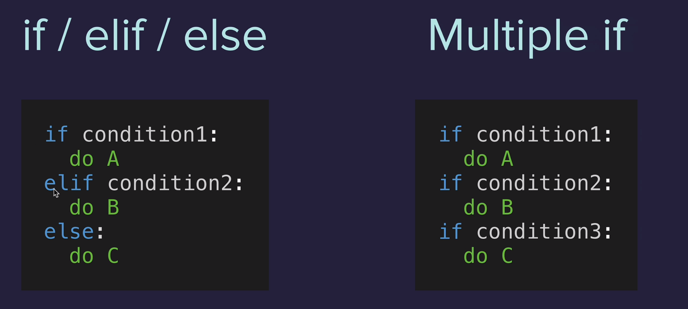
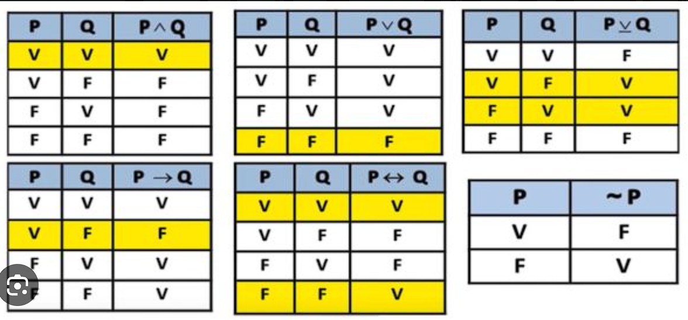
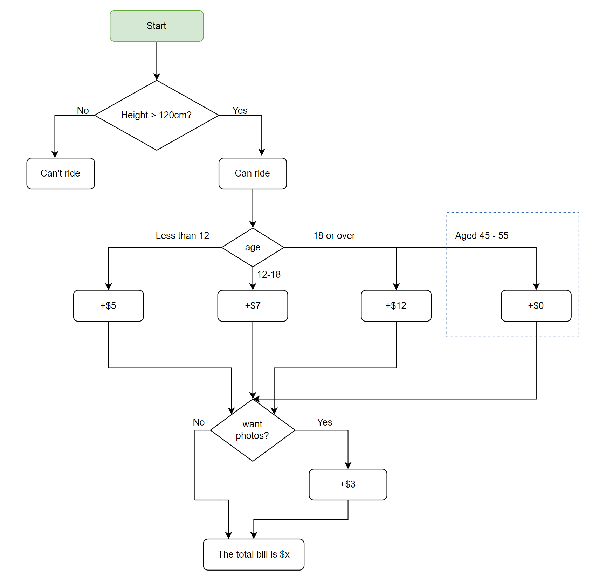
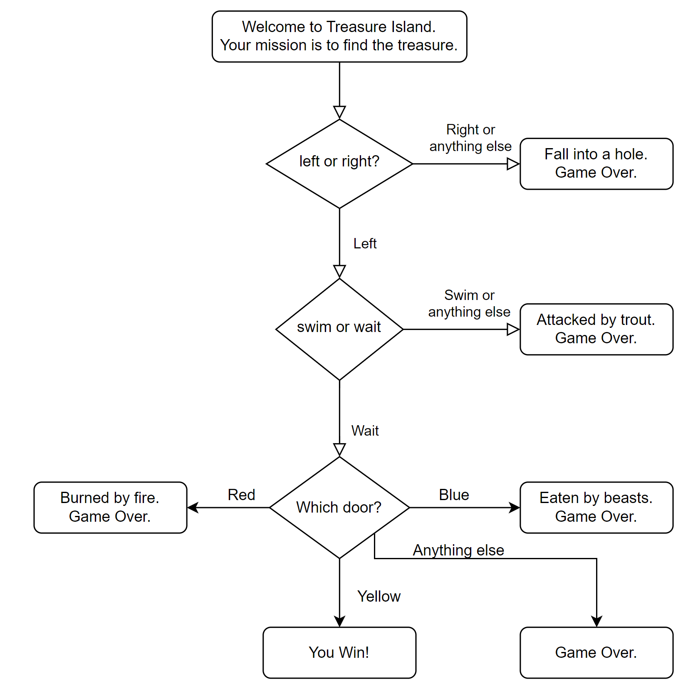

#### Odd or Even

> [!NOTE] **Odd or Even ?:** 
> ímpar ou par ?. É uma continha simples onde verifica-se se um número pode ser dividido por 2 sem restar nada além de 0. Isto é, um número par (even). Se a conta resultar em algo diferente de 0 é um número ímpar (odd).
> Para obtermos isso basta pegar o número e % 2, assim o Python já retorna com o valor 0 ou não. O módulo (%) é usado para obter-se o resto de uma divisão de um número por outro.  

>**Ímpar ou Par?
```python
#uma forma mais detalhada. 
numero = int (input())

resto = numero % 2

if numero == 0:
    print ("é um número par.")
else:
    print ("é um número impar.")

#um forma mais simples.
numero = int(input())

if numero % 2 == 0:
    print("é um número par.")
else:
    print("é um número ímpar.")
```

#### If/Elif/Else

> **Nested if/else:** um if dentro de outro if, uma condição dentro de outra condição. se tiver + que 1.20cm, se for maior de 18, faça isso, se não faça isso. 


>**Passei pelo Caminho dos Esquecidos**
```python
print("Bem vindo ao caminho dos esquecidos!!!")
print("Prepare-se para uma viagem inesquecível.")
altura = int(input("Qual a sua altura em Cm ?"))

if altura >= 120:
    print("Você pode seguir o caminho.")
    idade = int(input("Qual a sua idade ?"))
    if idade >= 18: #este é "Nested" porque está dentro de uma condição. 
        print("Pagar R$10.")
    else:
        print("Pagar R$5.")
else:
    print("Desculpe, você não pode seguir o caminho.")
```


**Nested if/elif/else:** um elif dentro de um if, uma condição dentro de outra condição. se tiver + que 1.20cm, se for maior de 18 cobre r$12, se for menor que 12 cobre r$5, se for entre 12 e 18 cobre r$7. 
Posso usar vários elif dentro de um if. 


```python
print("Bem vindo ao caminho dos esquecidos!!!")
print("Prepare-se para uma viagem inesquecível.")
altura = int(input("Qual a sua altura em Cm ?"))

if altura >= 120:
    print("Você pode seguir o caminho.")
    idade = int(input("Qual a sua idade ?"))
    if idade >= 18: #este é "Nested" porque está dentro de uma condição. 
        print("Pagar R$12.")
    elif idade <=12:
        print("Pagar R$5.")
    else:
	    print("Pagar R$7.")
else:
    print("Desculpe, você não pode seguir o caminho.")

```

>**IMC 2.0:** Nossa calculadora de IMC (índice de massa corporal) melhorada, com uma codificação mais robusta. 

```python
#Entre com a altura ex. 1.74
height = input("Digite sua altura :")
#Entre com o peso em Kg ex. 87
weight = input("Digite o seu peso :")

#Equação
heightf = float(height)
weightf = int(weight)
height2 = (heightf ** 2)

imc = (weightf // height2)#Usando divisão dupla (//) tem um efeito similar ao do round, isso declara como interger a equação.

if imc < 18.5:
    print(f"Você está magricelo, seu IMC é {imc}, alimente-se!")
elif imc >= 18.5 and imc < 25:
    print(f"Você está no shape, seu IMC é {imc}!")
elif imc >= 25 and imc < 30:
    print(f"Você está mei gordin, seu IMC é {imc}.")
elif imc >=30 and imc < 35:
    print(f"Você está obeso, seu IMC é {imc}.")
elif imc >= 35:
    print(f"Você está morrendo, seu IMC é {imc}")

### uma forma mais enxuta seria

if imc < 18.5: 
	print("Você está abaixo do peso, alimente-se!") 
elif 18.5 <= imc < 25: 
	print("Você está no shape!") 
elif 25 <= imc < 30: 
	print("Você está mei gordin.") 
elif 30 <= imc < 35: 
	print("Você está obeso.") 
elif imc >= 35: 
	print("Você está morrendo")
```

>**Obs:** o código será lido de cima para baixo, assim nosso código poderia ser conforme abaixo.

```python
#Entre com a altura ex. 1.74
height = input("Digite sua altura :")
#Entre com o peso em Kg ex. 87
weight = input("Digite o seu peso :")

#Equação
heightf = float(height)
weightf = int(weight)
height2 = (heightf ** 2)

imc = (weightf // height2)#Usando divisão dupla (//) tem um efeito similar ao do round, isso declara como interger a equação.
print (imc)
if imc < 18.5:
    print(f"Você está magricelo, seu IMC é {imc}, alimente-se!")
elif imc < 25:
    print(f"Você está no shape, seu IMC é {imc}!")
elif imc < 30:
    print(f"Você está mei gordin, seu IMC é {imc}.")
elif imc < 35:
    print(f"Você está obeso, seu IMC é {imc}.")
else:
    print(f"Você está morrendo, seu IMC é {imc}")
```

> [!NOTE] **Ano bissexto (leap year):** 
> Um ano bissexto ocorre a cada quatro anos para corrigir a discrepância entre o ano solar e o calendário anual.
> 
> Assim é como você determina se um ano específico é um ano bissexto.
>- em cada ano que é divisível por 4 sem resto
>- exceto em cada ano que é uniformemente divisível por 100 sem resto
>- a menos que o ano também seja divisível por 400 sem resto


```python
print("Vamos verificar se o ano é bissexto.")
ano = int(input("Digite o ano:"))

if ano % 4 == 0:
    if ano % 100 == 0:
        if ano % 400 == 0:
            print("É um ano bissexto")
        else:
            print("Não é um ano bissexto")
    else:
        print("É um ano bissexto")
else:
    print("Não é um ano bissexto")
```


#### If/Elif, Else, múltiplas condições

>[!NOTE]  If, Elif, Else
>Na imagem a seguir temos if e elif (esquerda) onde se 1(uma) das condições for verdadeira já atinge o objetivo e para a execução do código. À direta temos Multiple if que vai checando se uma condição for verdadeira, e, se for, segue para verificar a próxima condição. 




>[!NOTE] **Montanha da perdição**
>Embarque nessa aventura emocionante da montanha da perdição


```python
#código bem extenso. Mas temos uma versão mais simplificada logo abaixo na outra bateria de  código 

print("Bem-vindos à Montanha da Perdição")
altura = int(input("Digite sua altura em cm: "))

if altura > 120:
    idade = int(input("Digite a sua idade: "))
    if idade < 12:
        fotos = str(input("Deseja tirar uma foto da jornada (sim/não)? "))
        ingresso1 = 5
        if fotos.lower() == "sim":
            ingresso1 += 3 #note que pra eu acrescentar eu preciso colocar junto o =
            print(f"O total da sua conta ficou em R${ingresso1}, Obrigado!")
        else:
            print(f"O total da sua conta ficou em R${ingresso1}, Obrigado!")
    elif idade <= 18:
        fotos2 = str(input("Deseja tirar uma foto da jornada (sim/não)? "))
        ingresso2 = 7
        if fotos2.lower() == "sim":
            ingresso2 += 3 #note que pra eu acrescentar eu preciso colocar junto o =
            print(f"O total da sua conta ficou em R${ingresso2}, Obrigado!")
        else:
            print(f"O total da sua conta ficou em R${ingresso2}, Obrigado!")
    else:
        fotos3 = str(input("Deseja tirar uma foto da jornada (sim/não)? "))
        ingresso3 = 12
        if fotos3.lower() == "sim":
            ingresso3 += 3 #note que pra eu acrescentar eu preciso colocar junto o =
            print(f"O total da sua conta ficou em R${ingresso3}, Obrigado!")
        else:
            print(f"O total da sua conta ficou em R${ingresso3}, Obrigado!")        
else:
    print("Você não tem tamanho para ir nesta aventura.")
```

```python
#uma forma mais direta, objetiva e simplificada de executar a mesma aplicação. 

print("Bem-vindos à Montanha da Perdição") 
altura = int(input("Digite sua altura em cm: "))

if altura > 120: 
	idade = int(input("Digite a sua idade: ")) 
	if idade < 12: 
		ingresso = 5 
	elif idade <= 18: 
		ingresso = 7
	else: 
		ingresso = 12 
	fotos = str(input("Deseja tirar uma foto da jornada (sim/não)? "))
	if fotos.lower() == "sim": 
		ingresso += 3 
	print(f"O total da sua conta ficou em R${ingresso}, Obrigado!") 
else: 
	print("Você não tem tamanho para embarcar nesta aventura.")
```

> [!NOTE] **Pizzaria**
> Você abriu a sua tão sonhada pizzaria, chegou a hora de criar um sistema para a ordem de compra. 


```python
print("Sejam Bem-vindos à Galinha Morta Pizzaria")
pizza = str(input("Qual o tamanho de sua pizza? (P, M, G)"))
conta = 0

if pizza.lower() == "p":
    conta = 15
elif pizza.lower() == "m":
    conta = 20
elif pizza.lower() == "g":
    conta = 25

peperoni = str(input("Deseja adicionar Peperoni? (S/N)"))

if peperoni.lower() == "s":
    if pizza.lower() == "p":
        conta += 2
    else:
        conta += 3

queijo = str(input("Deseja adicionar Queijo Extra Power? (S/N)"))
if queijo.lower() == "s":
    conta += 1    

print(f"O valor total é igual a R${conta}, obrigado.")
```

#### Operadores lógicos

> Lembrar-se da tabela verdade.



```python
a = 12

#Operador 'and'
a <15 and >10 #ambas precisam ser "TRUE", e o valor retorna "TRUE"

#Operador 'or'
a <15 or a>20 #se uma for "TRUE" o valor retorna "TRUE".Apenas se ambas forem "FALSE" o valor retornará "FALSE"

#Operador "NOT"
not a >15 #O valor retorna "TRUE" apenas se o resultado da operação for o "FALSE"
```

> Montanha da perdição com operador lógico.



```python
print("Bem-vindos à Montanha da Perdição") 
altura = int(input("Digite sua altura em cm: "))


if altura > 120: 
    idade = int(input("Digite a sua idade: ")) 
    if idade < 12: 
        ingresso = 5
    elif idade <= 18: 
        ingresso = 7
    elif idade > 45 and idade < 55:
        ingresso = 0
    else: 
        ingresso = 12
    fotos = str(input("Deseja tirar uma foto da jornada (sim/não)? "))
    if fotos.lower() == "sim": 
        ingresso += 3 
    print(f"O total da sua conta ficou em R${ingresso}, Obrigado!") 
else: 
    print("Você não tem tamanho para embarcar nesta aventura.")
```

> [!NOTE] Em nome do amor
> Silvio Santos apresenta esse programa para ajudar os românticos a encontrar a sua alma gêmea.

```python
print("Bem-vindos ao Em nome do amor, com Silvio Santos!!!")
def calcular_pontuacao_amor(nome1, nome2):
    # Concatenar os nomes e converter para letras maiúsculas para tornar a comparação não sensível a maiúsculas/minúsculas
    nomes_concatenados = (nome1 + nome2).upper()

    # Contar o número de ocorrências das letras nas palavras "TRUE" e "LOVE"
    contagem_true = sum(nomes_concatenados.count(letra) for letra in "TRUE")
    contagem_love = sum(nomes_concatenados.count(letra) for letra in "LOVE")

    # Combinar as contagens para formar um número de 2 dígitos
    pontuacao_amor = int(f"{contagem_true}{contagem_love}")

    return pontuacao_amor

# Exemplo de uso
nome1 = input("Digite o primeiro nome: ")
nome2 = input("Digite o segundo nome: ")

pontuacao = calcular_pontuacao_amor(nome1, nome2)

if pontuacao < 10 or pontuacao > 90:
    print(f"Sua pontuação é {pontuacao}, vocês combinam como coca e mentos.")
elif 40 <= pontuacao <= 50:
    print(f"Sua pontuação é {pontuacao}, vocês estão bem juntos.")
else:
    print(f"Sua pontuação é {pontuacao}.")

```

> Outra forma de executar, Pontuação do amor

```python
print("Bem-vindos ao Em nome do amor, com Silvio Santos!!!")
name1 = input("Digite o seu nome: ") 
name2 = input("Digite o nome do seu amor: ")  

combined_names = name1 + name2 #aqui combinamos 2 strings em 1 para facilitar no calculo. 
lower_names = combined_names.lower() #tudo vira minúscula para também facilitar

#aqui iremos calcular quantas vezes cada letra aparece na variável lower_names
t = lower_names.count("t")
r = lower_names.count("r")
u = lower_names.count("u")
e = lower_names.count("e")
first_digit = t + r + u + e #o resultado de cada letra será somado aqui.

l = lower_names.count("l")
o = lower_names.count("o")
v = lower_names.count("v")
e = lower_names.count("e")
second_digit = l + o + v + e

total = int(str(first_digit) + str(second_digit)) #somamos os 2 resultados.

#Aqui temos as condicionantes. 
if total < 10 or total > 90:
    print(f"Sua pontuação é {pontuacao}, vocês combinam como coca e mentos.")
elif 40 <= total <= 50:#entre 40 e 50
    print(f"Sua pontuação é {pontuacao}, vocês estão bem juntos.")
else:
    print(f"Sua pontuação é {total}.")
```

#### Projeto

>[!NOTE] **Ilha do Kiko (Tesouro)**
>Você foi selecionado para ir em uma aventura em busca de um tesouro perdido. 




```python
print('''
*******************************************************************************
          |                   |                  |                     |
 _________|________________.=""_;=.______________|_____________________|_______
|                   |  ,-"_,=""     `"=.|                  |
|___________________|__"=._o`"-._        `"=.______________|___________________
          |                `"=._o`"=._      _`"=._                     |
 _________|_____________________:=._o "=._."_.-="'"=.__________________|_______
|                   |    __.--" , ; `"=._o." ,-"""-._ ".   |
|___________________|_._"  ,. .` ` `` ,  `"-._"-._   ". '__|___________________
          |           |o`"=._` , "` `; .". ,  "-._"-._; ;              |
 _________|___________| ;`-.o`"=._; ." ` '`."\` . "-._ /_______________|_______
|                   | |o;    `"-.o`"=._``  '` " ,__.--o;   |
|___________________|_| ;     (#) `-.o `"=.`_.--"_o.-; ;___|___________________
____/______/______/___|o;._    "      `".o|o_.--"    ;o;____/______/______/____
/______/______/______/_"=._o--._        ; | ;        ; ;/______/______/______/_
____/______/______/______/__"=._o--._   ;o|o;     _._;o;____/______/______/____
/______/______/______/______/____"=._o._; | ;_.--"o.--"_/______/______/______/_
____/______/______/______/______/_____"=.o|o_.--""___/______/______/______/____
/______/______/______/______/______/______/______/______/______/______/_____ /
*******************************************************************************
''')


print("Bem-Vindos a Ilha do Kiko (Tesouro).")
print("Sua missão será encontrar a Bola Quadrada.")
caminho = str(input("Vamos começar?!. Deseja seguir para a direita ou esquerda? "))

if caminho.lower() != "direita":
    print("Você caiu em um buraco. Fim do Jogo")
else:
    seguir = str(input("Há um rio a sua frente, irá nadar ou esperar? "))
    
    if seguir.lower() != "esperar":
        print("Você foi atacado por um Chupa-Cabra. Fim do Jogo")
    else:
        print("Há três portas a sua frente, Vermelha, Amarela e Azul")
        porta = str(input("Qual porta deseja abrir? "))
        
        if porta.lower() == "vermelha":
            print("Você foi queimado pelo fogo da mula sem cabeça. Fim do Jogo")
        elif porta.lower() == "azul":
            print("Você foi engolido por uma Sucuri de barriga roxa. Fim do Jogo")
        elif porta.lower() == "amarela":
            print("Parabéns, meu nobre!. Você encontrou a bola quadrada")
        else:
            print("FIM DO JOGO")
```

