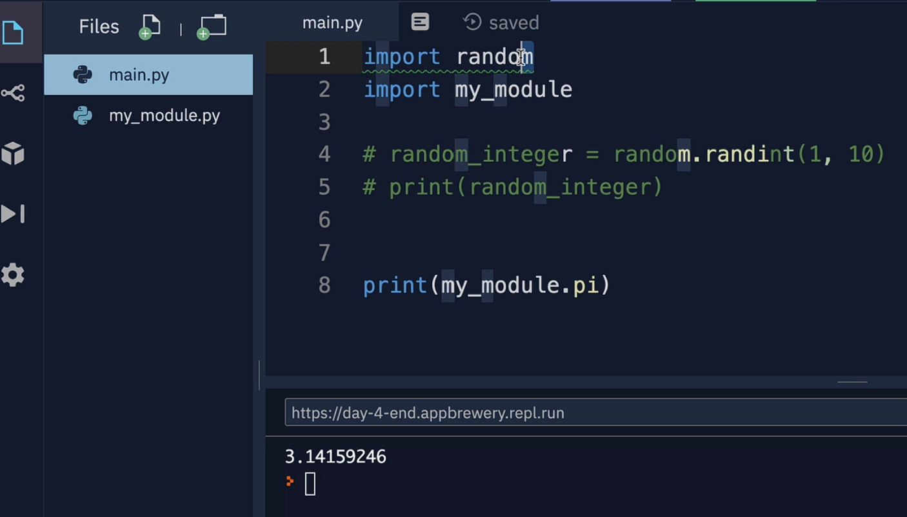

> [!NOTE] Pedra, Papel, Tesoura, Lagarto, Spock!!
> Iremos desenvolver esse jogo contagiante!!
>


```python
import random

pedra = '''
    _______
---'   ____)
      (_____)
      (_____)
      (____)
---.__(___)
'''

papel = '''
    _______
---'   ____)____
          ______)
          _______)
         _______)
---.__________)
'''

tesoura = '''
    _______
---'   ____)____
          ______)
       __________)
      (____)
---.__(___)
'''

game_images = [pedra, papel, tesoura]

print("Pedra, Papel, Tesoura, Lagarto, Spock!!!!\n")

user_choice = int(input("O que você escolhe? Digite 0 para pedra, 1 para Papel ou 2 para Tesoura.\n"))

if user_choice >= 3 or user_choice < 0: 
  print("Você digitou um número inválido, você perdeu!\n")
else:
  print(game_images[user_choice])

  computer_choice = random.randint(0, 2)
  print("Escolha da Interligência Artificial:")
  print(game_images[computer_choice])
  if user_choice == 0 and computer_choice == 2:
    print("Você ganhou!\n")
  elif computer_choice == 0 and user_choice == 2:
    print("Você perdeu\n")
  elif computer_choice > user_choice:
    print("Você perdeu\n")
  elif user_choice > computer_choice:
    print("Você ganhou!\n")
  elif computer_choice == user_choice:
    print("É uma armadilha!!, deu empate\n")
print("Vida longa e próspera!!")
        
```

#### Modules

>[!NOTE] Modules
>um módulo é um arquivo contendo definições e instruções Python. Essas definições e instruções podem incluir funções, classes e variáveis que você pode reutilizar em outros programas ou scripts Python. A ideia é organizar o código em módulos para tornar o código mais modular, fácil de entender, e para promover a reutilização de código.




#### Random

>[!NOTE] Módulo Random
>O módulo `random` em Python fornece funcionalidades relacionadas à geração de números aleatórios. Ele inclui várias funções que permitem criar sequências ou escolher elementos aleatórios.

```python
import random

#Ex.1
numero_aleatorio = random.random() 
print(numero_aleatorio)

#Ex.2
import random 

numero_aleatorio = random.randint(1, 10) 
print(numero_aleatorio)
```

>[!NOTE]Cara ou Coroa?(Head or Tail)
>Jogo de cara ou coroa usando o modulo random.

```python
# Jogo de cara ou coroa usando o módulo random  
import random  
  
print("Quem escolhe o restaurante ?\n")  
print("Vamos tirar no Cara ou Coroa\n")  
  
moeda = random.randint(0, 1)  
  
usuario_escolhe = int(input("Cara ou Coroa ? 0 = Cara, 1 = Coroa\n"))  
  
if usuario_escolhe != 0 and usuario_escolhe != 1:  
    print("Você digitou um valor errado, você perdeu.")  
else:  
    if moeda == 0:  
        moedastr = "Cara"  
    elif moeda == 1:  
        moedastr = "Coroa"  
  
    if usuario_escolhe == moeda:  
        print(f"Você ganhou, deu: {moedastr}")  
    else:  
        print(f"Você perdeu, deu: {moedastr}")
```

```python
#Aqui seria sem nenhuma interação do usuário

import random

moeda = random.randint(0,1)

if moeda == 1:
  moedastr = "Cara"
  print(f"{moedastr}")
else:
  moedastr = "Coroa"
  print(f"{moedastr}")

```

```python
### Mais simples ainda


import random

moeda = random.randint(0,1)

if moeda == 1:
  print("Cara")"
else:
  print("Coroa")
```

#### List

>[!NOTE] Listas
>[5. Data Structures — Python 3.12.1 documentation](https://docs.python.org/3/tutorial/datastructures.html)

```python
#Alguns exemplos apenas
fruits = ['orange', 'apple', 'pear', 'banana', 'kiwi', 'apple', 'banana']
>>> fruits.count('apple')
2
>>> fruits.count('tangerine')
0
>>> fruits.index('banana')
3
>>> fruits.index('banana', 4)  # Find next banana starting at position 4
6
>>> fruits.reverse()
>>> fruits
['banana', 'apple', 'kiwi', 'banana', 'pear', 'apple', 'orange']
>>> fruits.append('grape')
>>> fruits
['banana', 'apple', 'kiwi', 'banana', 'pear', 'apple', 'orange', 'grape']
>>> fruits.sort()
>>> fruits
['apple', 'apple', 'banana', 'banana', 'grape', 'kiwi', 'orange', 'pear']
>>> fruits.pop()
'pear'
```

>[!NOTE] Append
>inclui um objeto ao final da lista.
>lista = ["em", "nome", "do"]
>lista.append("amor")

>[!NOTE] Extend
>inclui uma série de objetos ao final de uma lista
>lista = ["O", "amor", "é"]
>lista.extend = ["único", "caminho"

```python
#Quem vai pagar a conta ?
#código simples que pega os nomes de 4 pessoas e (de forma aleatória) seleciona 1 para pagar a conta. 
import random  
  
nomes_string = ("Valdir, Gessika, Abreu, Jubileu")  
nomes = nomes_string.split(",") '''está dividindo uma string em uma lista de substrings com base em um delimitador  
no caso, a vírgula'''  
  
nome_aleatorio = random.sample (nomes, 1) [0] '''retornará uma lista com um único elemento, e [0] é usado para acessar esse único elemento.'''  
  
print(f"{nome_aleatorio} vai pagar o lancho hoje!")
```

```python
#outra forma de fazer

import random
names_string = ("Valdir, Gessika, Abreu, Jubileu")  
names = names_string.split(", ")


# Get the total number of items in list.
num_items = len(names)
# Generate random numbers between 0 and the last index. 
random_choice = random.randint(0, num_items - 1)
# Choose and print a random name.
print(names[random_choice])
```

```python
#Lista dentro de lista

frutas = ["Morango", "Maçã", "Laranja", "Goiaba"]
vegetais = ["Cenoura", "Cebola", "Pepino", "Abobora"]

salada_mista = [frutas, vegetais]

print (salada_mista)
```

```python
#mais um exemplo
fruits = ["Strawberries", "Nectarines", "Apples", "Grapes", "Peaches", "Cherries", "Pears"] 

vegetables = ["Spinach", "Kale", "Tomatoes", "Celery", "Potatoes"]

dirty_dozen = [fruits, vegetables] print(dirty_dozen[1][1])

#No exemplo acima o print imprime o primeiro elemento 1 da lista dirty_dozen e depois o elemento 1 que está dentro dessa outra lista, no caso, vegetables

out: Kale
```

#### Bingo!!

```python
'''A ideia é como se fosse um bingo, o locutor canta a pedra A1, B3 e você vai marcando  
Coluna + Linha'''  
  
line1 = ["⬜️", "⬜️", "⬜️"]  
line2 = ["⬜️", "⬜️", "⬜️"]  
line3 = ["⬜️", "⬜️", "⬜️"]  
map = [line1, line2, line3]  
print("Hiding your treasure! X marks the spot.")  
position = str(input())  
  
# A  
if position.lower() == "a1":  
    line1[0] = "X"  
elif position.lower() == "a2":  
    line2[0] = "X"  
elif position.lower() == "a3":  
    line3[0] = "X"  
# B  
if position.lower() == "b1":  
    line2[1] = "X"  
elif position.lower() == "b2":  
    line2[1] = "X"  
elif position.lower() == "b3":  
    line3[1] = "X"  
# C  
if position.lower() == "c1":  
    line1[2] = "X"  
elif position.lower() == "c2":  
    line2[2] = "X"  
elif position.lower() == "c3":  
    line3[2] = "X"
```

```python
#outra forma seria

line1 = ["⬜️","️⬜️","️⬜️"]
line2 = ["⬜️","⬜️","️⬜️"]
line3 = ["⬜️️","⬜️️","⬜️️"]
map = [line1, line2, line3]
print("Hiding your treasure! X marks the spot.")
position = input() # Where do you want to put the treasure?
# Your code below
letter = position[0].lower() #extrai o primeiro caractere que foi inserido pelo usuário
abc = ["a", "b", "c"] #cria uma lista chamada abc, representa as letras das colunas
#abc criará uma forma que se o 1º caractere que for digitado for != de a, b ou c, dará erro
letter_index = abc.index(letter) #obtém o ídice da letra. Eu quero saber em qual
#posição da lista abc está o a, o b ou o c. Para isso eu pego lá o letter que só recebe
#AX, BX ou CX. Isso é o mesmo que eu mesmo digitar a letra do intex da variável abc
number_index = int(position[1]) - 1 #obtém o índice númerico, converte para inteiro
#e subtrai para obter o índice correto onde o elemento está na lista, lembra que position[0] pega o primeiro
#caractere digitado pelo usuário ?. Position[1] pega o segundo. 
map[number_index][letter_index] = "X"#Aqui ele pega ex: [0][0], vai marcar com
#um X na primeira lista que está dentro da lista mapa e no primeiro elemento que está dentro da lista que está dentro da lista mapa.


print(f"{line1}\n{line2}\n{line3}")

```

> [!NOTE] Explicando
> 1. `position = input()`: Solicita ao usuário inserir uma posição, e a entrada é armazenada na variável `position`.
 >   
>2. `letter = position[0].lower()`: Extrai o primeiro caractere da posição inserida pelo usuário (`position[0]`), converte-o para minúsculas usando o método `lower()`, e atribui o resultado à variável `letter`. Isso é feito para garantir que a letra seja tratada de maneira insensível a maiúsculas e minúsculas.
  >  
>3. `abc = ["a", "b", "c"]`: Cria uma lista chamada `abc` que representa as letras que podem ser usadas no índice horizontal do mapa.
  >  
>4. `letter_index = abc.index(letter)`: Obtém o índice da letra (convertida para minúsculas) na lista `abc`. Isso determina em qual coluna da matriz (mapa) o "X" será colocado.
  >  
>5. `number_index = int(position[1]) - 1`: Obtém o índice numérico da posição inserida pelo usuário (`position[1]`), converte-o para um número inteiro usando `int()`, e subtrai 1 para obter o índice correto na lista. Isso determina em qual linha da matriz (mapa) o "X" será colocado.
  >  
>6. `map[number_index][letter_index] = "X"`: Coloca o "X" na posição determinada pelos índices `number_index` e `letter_index` na matriz `map`.
