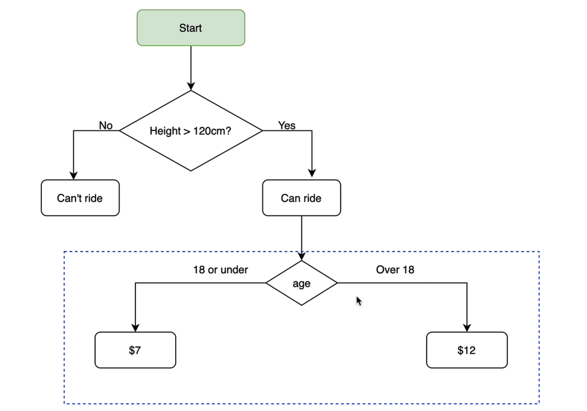
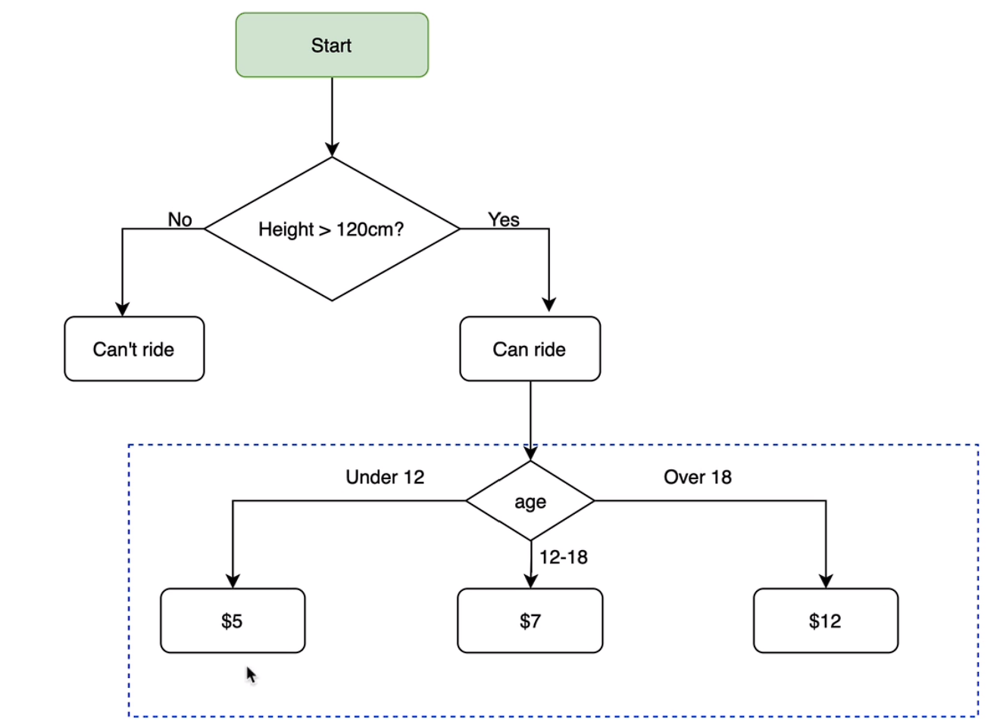
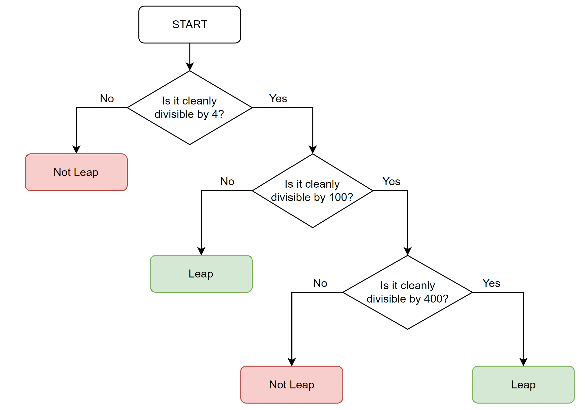
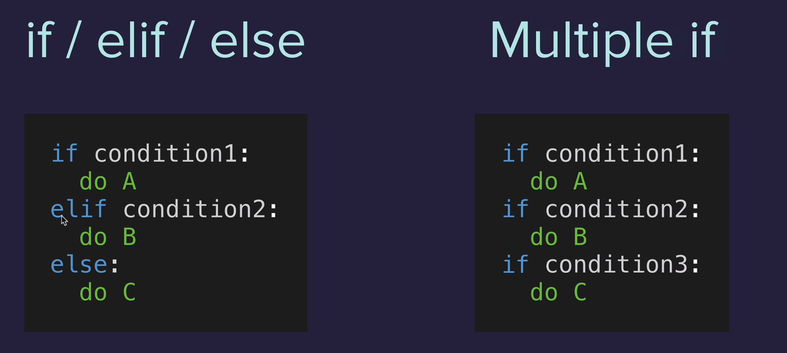
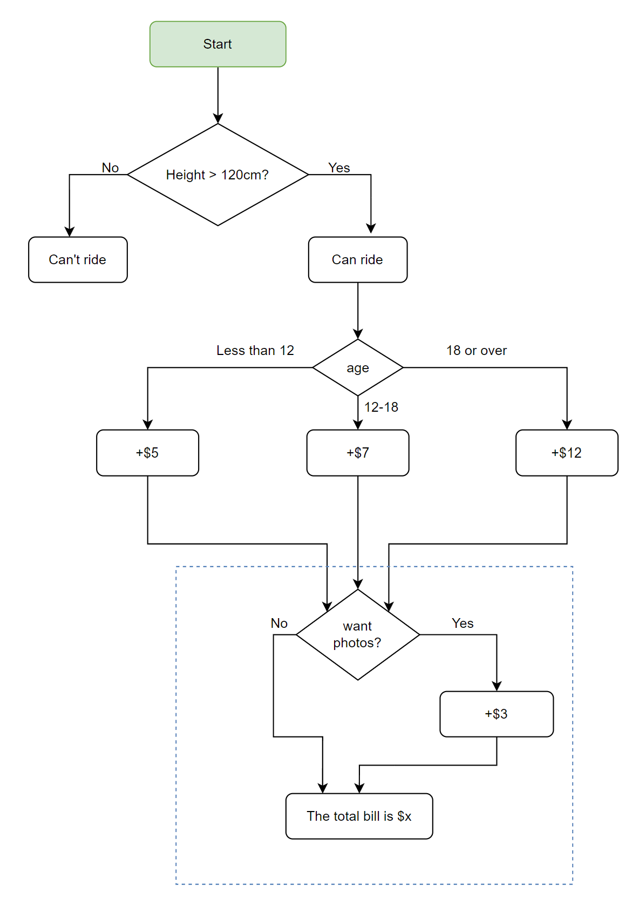

#python #100dias #100days
#cloud #coding
#spockiscoding #developer

Obs: em alguns códigos teremos um **out** para exemplificar como será a saída do código, apenas em casos que realmente for necessário para a fixação do conteúdo. 

## Dia 1

#### Troca (switch) de variáveis

> Para a troca de variáveis é preciso criar um nova variável provisória que receberá o valor que será posteriormente utilizado. Isso pq uma variável irá sobrescrever a outra. 

```python
#Q: Troque A por B, B por A
a=10
b=20
#Errado, quando A=B, o valor de A passa a não existir mais. Assim, Se B = A, os valores ficarão iguais.
a=b
b=a
#Certo, C recebe o valor de A, A recebe o Valor de B, e B recebe o valor de A que foi guardado em C
c=a
a=b
b=c

print("A: "+a)
print("B: "+b)
```

#### Espaçamento e quebra de linha

> Para dar um espaçamento ou coloca o espaço na string antes do final das aspas ou coloca uma string vazia
> Para quebra de linha basta colocar \n

```python
print("Jesus "+"te "+"ama\n")
print("E"+" "+"Eu"+" "+"também")
```

#### Input e Len

> Input é para entrada de dados, onde o sistema espera uma interação do usuário
> Len é para contar quantos caracteres tem uma variável. Len exibe um valor inteiro. 

```python
#Há uma forma simples porém pode ficar com uma linha enorme. 
print(len(input()))
#Há uma forma mais complexa declarando todas as variáveis. 
nome = input("digite seu nome :")
valor = len(nome)
print(valor)
```


## Dia 2

#### Data Types

> **String:** é uma variável do tipo texto que é declarada entre aspas ex. "Hello". É possível mostrar qual a posição de cada caractere usando uma lista

```python
#Iremos imprimir apenas o caractere na posição 1, lembrando que começa em 0
print ("hello"[1])
out: e

#Concatenar string. Mesmo se o interger estiver dentro das aspas ele será manipulado como texto. 
print ("amor"+"maior")
out: amormaior
print ("123"+"love")
out: 123love
print ("123"+"456")
out: 123456
```

>**Interger:** é uma variável do tipo inteiro, um número. 

```python
#para declarar um interger basta digitar
123

#soma 
print(1 + 3)
out: 4

#é comum usar o caractere de sublinhado (`_`) como um separador visual em números grandes para tornar mais fácil a leitura dos dígitos. O Interpretador ignora o sublinhado. 
123_456_789
```

> **Float:** é uma variável para se trabalhar com ponto decimal. Pontos Flutuantes são usados para representar números reais. 

```python
3.456
345.6
```

> **Boolean:** são usados para representar apenas dois estados True ou False

```python
True
False
```

> **Len:** len conta quantos caracteres tem em uma string, a questão é que len retorna um valor interger. Quando se tenta concatenar um len com uma string o interpretador apresenta um erro. 

```python
#código que irá apresentar o erro, por que concatenou string com interger
num_char = len(input("Qual é o seu nome ?"))
print("Seu nome tem" + num_char + "caracteres")

#para checar qual o tipo da variável
num_char = len(input("Qual é o seu nome ?"))
print(type(num_char))
out: Qual é o seu nome ? lima
<class 'int'>

#para contornar, basta converter a variável.
num_char = len(input("Qual é o seu nome ? "))
new_num_char = str(num_char)
print("Seu nome tem " + new_num_char + " caracteres")

#outro exemplo, esse usa uma lista para pegar o primeiro e o segundo caractere que foi informado na string e converter para int. 
two_digit_number = input()
num1 = int(two_digit_number[0])
num2 = int(two_digit_number[1])

print(num1 + num2)
```

> **Operações Matemáticas:*** dividir, somar, subtrair, multiplicar, potencializar. 

```python
3 + 5
7 - 4
3 * 2
6 / 3 #uma divisão resulta em um float
2 ** 3 #potencia, exponencial

#Não esquecer de seguir a ordem das operações, PEMDAS
Parênteses = ()
Exponentes = **
Multiplicação = *
Divisão = /
Adição = +
Subtração = -
```

> **IMC:** calculadora simples de IMC. IMC = peso / pela altura elevada ao quadrado

```python
#Entre com a altura ex. 1.74
height = input("Digite sua altura :")
#Entre com o peso em Kg ex. 87
weight = input("Digite o seu peso :")

#Equação
heightf = float(height)
weightf = int(weight)
height2 = (heightf ** 2)
bmi = round(weightf / height2) #A função round é para arredondar números em float,
#e o número depois da vírgula é a quantidade de casas decimais que se deseja após o ponto flutuante.
bmi = (weightf // height2)#Usando divisão dupla (//) tem um efeito similar ao do round, isso declara como interger a equação.
print (f"Seu IMC é igual a : {bmi}") #Observe que incluímos o f antes da sintaxe do print, 
#isso é para formatar uma string usando f-string, a variável fica entre chaves {}

#caso queira saber qual o tipo da variável
print(type(bmi))
out: <class 'float'>
```

>**Expectativa de vida:** calcule quantas semanas nos resta se vivêssemos até os 90 anos.

```python
#1 ano possui 52 semanas
age = input("Digite sua idade :")

life_expect = ((90 - int(age)) * 52) #converto a string age em int
print(f"You have {life_expect} weeks left") #uso f-string para exibir o resultado,
```

>**Gorjeta:** um calculador simples de gorjeta

```python
print("Seja bem-vindo ao Gorja calculator !!!")
conta = input("Qual o valor da conta ?: ")
gorjeta = input ("Quanto quer pagar de gorjeta 10,12,15% ?: ")
pessoas = input ("Quantas pessoas irão dividir a conta ?: ")

gorjeta_total = (float(gorjeta) / 100) #converte string em float  e divide por 100, para obter o percentual
parcial_conta = (gorjeta_total * float(conta) + float(conta)) #converte string em float e multiplica o percentual da gorjeta
#pelo total da conta para obter o valor da conta + o percentual
total_conta_dividida = (parcial_conta / float(pessoas)) #Divide o total da conta + gorjeta pela quantidade de pessoas a mesa

print(f"Cada pessoa deverá pagar R${total_conta_dividida} ")

#observe que não utilizados round ou // para arredondar pois estaríamos arredondado para o menor valor

#para arredondar para cima poderíamos usar o ceil
resultado = dividendo / divisor 
resultado_arredondado = ceil(resultado)

#uma forma mais limpa de se fazer seria o input já convertido:

print("Seja bem-vindo ao Gorja calculator !!!")
conta = float(input("Qual o valor da conta ?: "))
gorjeta = int(input ("Quanto quer pagar de gorjeta 10,12,15% ?: "))
pessoas = int(input ("Quantas pessoas irão dividir a conta ?: "))

gorjeta_total = gorjeta / 100 #obter o percentual
parcial_conta = (gorjeta_total * conta + conta) #multiplica o percentual da gorjeta
#pelo total da conta para obter o valor da conta + o percentual
total_conta_dividida = parcial_conta / pessoas #Divide o total da conta + gorjeta pela quantidade de pessoas a mesa

print(f"Cada pessoa deverá pagar R${total_conta_dividida} ")


```
## Dia 3

#### Odd or Even

> **Odd or Even ?:** ímpar ou par ?. É uma continha simples onde verifica-se se um número pode ser dividido por 2 sem restar nada além de 0. Isto é, um número par (even). Se a conta resultar em algo diferente de 0 é um número ímpar (odd).
> Para obtermos isso basta pegar o número e % 2, assim o Python já retorna com o valor 0 ou não. O módulo (%) é usado para obter-se o resto de uma divisão de um número por outro.  

>**Ímpar ou Par?
```python
#uma forma mais detalhada. 
numero = int (input())

resto = numero % 2

if numero == 0:
    print ("é um número par.")
else:
    print ("é um número impar.")

#um forma mais simples.
numero = int(input())

if numero % 2 == 0:
    print("é um número par.")
else:
    print("é um número ímpar.")
```

#### If/Elif/Else

> **Nested if/else:** um if dentro de outro if, uma condição dentro de outra condição. se tiver + que 1.20cm, se for maior de 18, faça isso, se não faça isso. 




>**Passei pelo Caminho dos Esquecidos**
```python
print("Bem vindo ao caminho dos esquecidos!!!")
print("Prepare-se para uma viagem inesquecível.")
altura = int(input("Qual a sua altura em Cm ?"))

if altura >= 120:
    print("Você pode seguir o caminho.")
    idade = int(input("Qual a sua idade ?"))
    if idade >= 18: #este é "Nested" porque está dentro de uma condição. 
        print("Pagar R$10.")
    else:
        print("Pagar R$5.")
else:
    print("Desculpe, você não pode seguir o caminho.")
```


**Nested if/elif/else:** um elif dentro de um if, uma condição dentro de outra condição. se tiver + que 1.20cm, se for maior de 18 cobre r$12, se for menor que 12 cobre r$5, se for entre 12 e 18 cobre r$7. 
Posso usar vários elif dentro de um if. 



```python
print("Bem vindo ao caminho dos esquecidos!!!")
print("Prepare-se para uma viagem inesquecível.")
altura = int(input("Qual a sua altura em Cm ?"))

if altura >= 120:
    print("Você pode seguir o caminho.")
    idade = int(input("Qual a sua idade ?"))
    if idade >= 18: #este é "Nested" porque está dentro de uma condição. 
        print("Pagar R$12.")
    elif idade <=12:
        print("Pagar R$5.")
    else:
	    print("Pagar R$7.")
else:
    print("Desculpe, você não pode seguir o caminho.")

```

>**IMC 2.0:** Nossa calculadora de IMC (índice de massa corporal) melhorada, com uma codificação mais robusta. 

```python
#Entre com a altura ex. 1.74
height = input("Digite sua altura :")
#Entre com o peso em Kg ex. 87
weight = input("Digite o seu peso :")

#Equação
heightf = float(height)
weightf = int(weight)
height2 = (heightf ** 2)

imc = (weightf // height2)#Usando divisão dupla (//) tem um efeito similar ao do round, isso declara como interger a equação.

if imc < 18.5:
    print(f"Você está magricelo, seu IMC é {imc}, alimente-se!")
elif imc >= 18.5 and imc < 25:
    print(f"Você está no shape, seu IMC é {imc}!")
elif imc >= 25 and imc < 30:
    print(f"Você está mei gordin, seu IMC é {imc}.")
elif imc >=30 and imc < 35:
    print(f"Você está obeso, seu IMC é {imc}.")
elif imc >= 35:
    print(f"Você está morrendo, seu IMC é {imc}")

### uma forma mais enxuta seria

if imc < 18.5: 
	print("Você está abaixo do peso, alimente-se!") 
elif 18.5 <= imc < 25: 
	print("Você está no shape!") 
elif 25 <= imc < 30: 
	print("Você está mei gordin.") 
elif 30 <= imc < 35: 
	print("Você está obeso.") 
elif imc >= 35: 
	print("Você está morrendo")
```

>**Obs:** o código será lido de cima para baixo, assim nosso código poderia ser conforme abaixo.

```python
#Entre com a altura ex. 1.74
height = input("Digite sua altura :")
#Entre com o peso em Kg ex. 87
weight = input("Digite o seu peso :")

#Equação
heightf = float(height)
weightf = int(weight)
height2 = (heightf ** 2)

imc = (weightf // height2)#Usando divisão dupla (//) tem um efeito similar ao do round, isso declara como interger a equação.
print (imc)
if imc < 18.5:
    print(f"Você está magricelo, seu IMC é {imc}, alimente-se!")
elif imc < 25:
    print(f"Você está no shape, seu IMC é {imc}!")
elif imc < 30:
    print(f"Você está mei gordin, seu IMC é {imc}.")
elif imc < 35:
    print(f"Você está obeso, seu IMC é {imc}.")
else:
    print(f"Você está morrendo, seu IMC é {imc}")
```

> **Ano bissexto (leap year):** Um ano bissexto ocorre a cada quatro anos para corrigir a discrepância entre o ano solar e o calendário anual.
> 
> Assim é como você determina se um ano específico é um ano bissexto.
- em cada ano que é divisível por 4 sem resto
- exceto em cada ano que é uniformemente divisível por 100 sem resto
- a menos que o ano também seja divisível por 400 sem resto



```python
print("Vamos verificar se o ano é bissexto.")
ano = int(input("Digite o ano:"))

if ano % 4 == 0:
    if ano % 100 == 0:
        if ano % 400 == 0:
            print("É um ano bissexto")
        else:
            print("Não é um ano bissexto")
    else:
        print("É um ano bissexto")
else:
    print("Não é um ano bissexto")
```


#### If/Else, múltiplas condições

>Na imagem a seguir temos if e elif (esquerda) onde se 1(uma) das condições for verdadeira já atinge o objetivo e para a execução do código. À direta temos Multiple if que vai checando se uma condição for verdadeira, e, se for, segue para verificar a próxima condição. 





>**Montanha da perdição**
```python
#código bem extenso. Mas temos uma versão mais simplificada logo abaixo na outra bateria de  código 

print("Bem-vindos à Montanha da Perdição")
altura = int(input("Digite sua altura em cm: "))

if altura > 120:
    idade = int(input("Digite a sua idade: "))
    if idade < 12:
        fotos = str(input("Deseja tirar uma foto da jornada (sim/não)? "))
        ingresso1 = 5
        if fotos.lower() == "sim":
            ingresso1 += 3 #note que pra eu acrescentar eu preciso colocar junto o =
            print(f"O total da sua conta ficou em R${ingresso1}, Obrigado!")
        else:
            print(f"O total da sua conta ficou em R${ingresso1}, Obrigado!")
    elif idade > 18:
        fotos2 = str(input("Deseja tirar uma foto da jornada (sim/não)? "))
        ingresso2 = 12
        if fotos2.lower() == "sim":
            ingresso2 += 3 #note que pra eu acrescentar eu preciso colocar junto o =
            print(f"O total da sua conta ficou em R${ingresso2}, Obrigado!")
        else:
            print(f"O total da sua conta ficou em R${ingresso2}, Obrigado!")
    else:
        fotos3 = str(input("Deseja tirar uma foto da jornada (sim/não)? "))
        ingresso3 = 7
        if fotos3.lower() == "sim":
            ingresso3 += 3 #note que pra eu acrescentar eu preciso colocar junto o =
            print(f"O total da sua conta ficou em R${ingresso3}, Obrigado!")
        else:
            print(f"O total da sua conta ficou em R${ingresso3}, Obrigado!")        
else:
    print("Você não tem tamanho para ir nesta aventura.")
```

```python
#uma forma mais direta, objetiva e simplificada de executar a mesma aplicação. 

print("Bem-vindos à Montanha da Perdição") 
altura = int(input("Digite sua altura em cm: "))

if altura > 120: 
	idade = int(input("Digite a sua idade: ")) 
	if idade < 12: 
		ingresso = 5 
	elif idade > 18: 
		ingresso = 12 
	else: 
		ingresso = 7 
	fotos = str(input("Deseja tirar uma foto da jornada (sim/não)? "))
	if fotos.lower() == "sim": 
		ingresso += 3 
	print(f"O total da sua conta ficou em R${ingresso}, Obrigado!") 
else: 
	print("Você não tem tamanho para embarcar nesta aventura.")
```

> **Pizzaria**
```python
print("Sejam Bem vindos ao Galinha Morta Pizzaria")
pizza = str(input("Qual o tamanho de sua pizza ? (P,M,G)"))
conta = 0

if pizza.lower() == "p":
    conta = 15
elif pizza.lower() == "m":
    conta = 20
elif pizza.lower() == "g":
    conta = 25
    
peperoni = str(input("Deseja adicionar Peperoni ? (S/N)"))

if peperoni.lower() == "s" and pizza.lower() == "p":
    conta += 2
else:
    conta += 3
    
queijo = str(input("Deseja adicionar Queijo Extra Power ? (S/N)"))
if queijo.lower() == "s":
    conta += 1    
print(f"O valor total é igual R${conta}, obrigado.")
```

